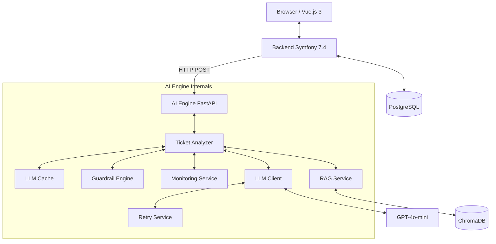

# AI Support Copilot 🤖

Intelligent customer support assistance application. This project leverages the power of **RAG** (Retrieval-Augmented Generation) to analyze incoming tickets and suggest resolutions.

---

## 🏗️ System Architecture

The project uses a decoupled architecture for performance and scalability:



---

## 📋 Prerequisites

Ensure you have the following installed on your machine:
- **Docker & Docker Compose**
- **PHP 8.2+** & **Composer**
- **Node.js 18+** & **npm**
- **Python 3.10+** & **pip**
- **Symfony CLI** (optional but recommended)

---

## 🚀 Installation & Setup

### 1. Infrastructure (Docker)
Start the database (PostgreSQL), message broker (Redis), and management tools (pgAdmin):
```bash
cd backend-symfony
docker compose up -d
```

### 2. Backend Symfony
Install dependencies and prepare the database:
```bash
cd backend-symfony
composer install
npm install
npm run build

# Run migrations to create the schema
php bin/console doctrine:migrations:migrate --no-interaction
```

### 3. AI Engine (Python)
Setup the virtual environment and install dependencies:
```bash
cd ai-engine
python -m venv venv
source venv/bin/activate  # Linux/Mac
# venv\Scripts\activate  # Windows

pip install -r requirements.txt
```

---

## ⚙️ Configuration

Copy the example environment files and fill in your secrets:

### AI Engine (`ai-engine/ai_service/.env`)
Create the file and add your OpenAI API key:
```env
OPENAI_API_KEY=sk-....
AI_MODEL_NAME=gpt-4o-mini
AI_PROMPT_VERSION=2.0_decision_engine
AI_GUARDRAIL_VERSION=1.0
AI_MONITORING_VERSION=1.0
```

### Backend Symfony (`backend-symfony/.env.local`)
The default `DATABASE_URL` in `.env` is pre-configured for the Docker setup.

---

## 📚 Database & RAG Ingestion

Before running the AI analysis, you must populate the vector database with your technical documentation:

1. Place your `.txt` documents in `ai-engine/rag_docs/`.
2. Run the ingestion script:
```bash
cd ai-engine
source venv/bin/activate
python -m ai_service.ingest_rag_docs
```

---

## 🏃 Running the Application

You need **3 separate terminals** to run the full system:

**Terminal 1: Symfony Web Server**
```bash
cd backend-symfony
symfony server:start --port=8001
```

**Terminal 2: AI Engine API (FastAPI)**
```bash
cd ai-engine
source venv/bin/activate
uvicorn api.main:app --reload --port 8000
```

**Terminal 3: RQ Worker (Background Jobs)**
```bash
cd ai-engine
source venv/bin/activate
rq worker ticket-analysis
```

---

## 🧪 Testing the Pipeline

### Automated Test Script
You can trigger a test analysis without using the UI:
```bash
cd ai-engine
source venv/bin/activate
python test_queue.py
```
*Check Terminal 3 (Worker) to see the processing logs!*

### Web Interface
1. Open [http://localhost:8001](http://localhost:8001) in your browser.
2. Create a new support ticket.
3. The AI Engine will process it in the background, and the results will appear once finished.

---

## 🛠️ Advanced Features
- **LLM Caching**: SHA-256 prompted-based caching to save cost and time.
- **Deterministic Guardrails**: Hardcoded logic for high-urgency and legal safety.
- **Monitoring**: Token counting and real-time cost estimation per request.
- **Exponential Backoff**: Resilient API calls via `RetryService`.

---

## 📄 License
Proprietary
