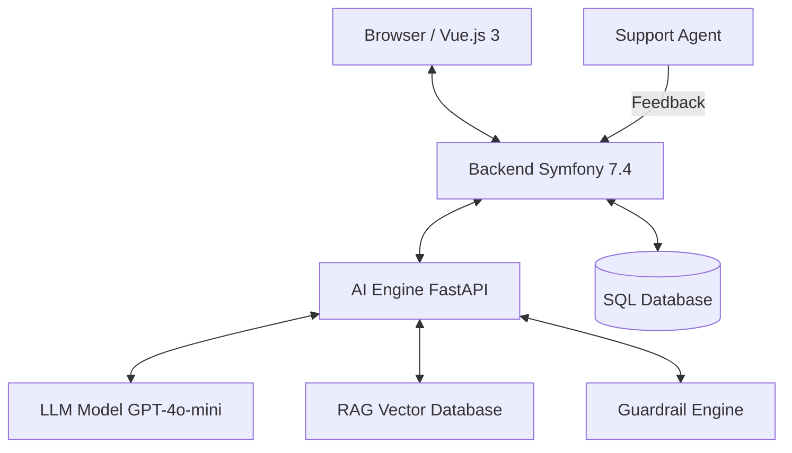

# AI Support Copilot

Intelligent customer support assistance application. This project leverages the power of **RAG** (Retrieval-Augmented Generation) to analyze incoming tickets, suggest resolutions based on technical documentation, and secures decisions via a deterministic **Guardrails** engine and a **Feedback (Human-in-the-loop)** system.

---

## 🏗️ System Architecture

The project is based on a decoupled architecture ensuring performance, isolation, and scalability:



- **Frontend**: Reactive Vue.js 3 components integrated via Symfony UX.
- **Backend (Orchestrator & Persistence)**: Symfony 7.4 manages the ticket lifecycle, analysis persistence, and feedback.
- **AI Engine (Intelligence)**: FastAPI (Python) specialized in RAG and output security.

---

## 🧠 Analysis Pipeline & Lifecycle

The ticket analysis process follows a rigorous 5-step pipeline:

1.  **Enrichment (RAG)**: Search for relevant documents in `rag_docs/`.
2.  **LLM Inference**: Generation of a proposal via a structured and versioned prompt.
3.  **Security (Guardrails)**: Automatic correction via business rules (e.g., legal filtering).
4.  **Meta Enrichment**: Calculation of costs, latency, and tokens for monitoring.
5.  **Feedback (Human-in-the-loop)**: Validation/Rejection by the agent for continuous improvement.

---

## 🏗️ Design Decisions (AI Systems Engineering)

- **AI Engine Isolation (FastAPI)**: Isolation of heavy Python dependencies and independent scalability from the PHP backend.
- **Human-in-the-loop**: Systematic collection of "ground truth" via agent feedback for future fine-tuning.
- **Deterministic Guardrails**: Secure business invariants regardless of the LLM's statistical probability.
- **Prompt Versioning**: Each analysis is traced to allow for debugging and auditing.

---

## 🛡️ Observability & Guardrails (Details)

The **AI Engine** integrates a robust monitoring and security layer:

- **Decision / Meta Separation**: Each response separates validated business data via Pydantic (`summary`, `category`, etc.) from technical metadata.
- **Guardrail Engine**: Deterministic rules acting in post-processing:
  - **GR-001**: Forces `escalation_required` to `true` if urgency is `high`.
  - **GR-002**: Detection of legal keywords (e.g., 'lawsuit', 'attorney') for manual escalation.
  - **GR-003**: Prohibition of FAQ for critical cases, redirection to after-sales procedure.
- **Financial Tracking**: Real-time calculation based on current rates (e.g., $0.15/1M input tokens for `gpt-4o-mini`).

---

## 📋 Prerequisites

### Backend Symfony
- PHP >= 8.2 & Composer
- Node.js >= 18.x & npm
- Symfony CLI (optional but recommended)

### AI Engine
- Python >= 3.10 & pip

---

## 🚀 Installation

### 1. Backend Symfony Installation
```bash
cd backend-symfony
composer install
npm install
npm run build
```

### 2. AI Service Installation (Python)
```bash
cd ai-engine
python -m venv venv
source venv/bin/activate
pip install -r requirements.txt
```

---

## 🗄️ Database & Docker

The Symfony backend uses **PostgreSQL** as the main database, managed via **Docker Compose**. An administration tool, **pgAdmin**, is also included.

### 1. Start Services
```bash
cd backend-symfony
docker compose up -d
```
This will launch:
- **PostgreSQL 16** (Default Port: `5432`)
- **pgAdmin 4**: Accessible at [http://localhost:8080](http://localhost:8080)
  - *Email*: `admin@example.com`
  - *Password*: `admin`

### 2. Initialize the Database
Once the containers are running, execute the Symfony migrations:
```bash
cd backend-symfony
php bin/console doctrine:migrations:migrate
```

---

## ▶️ Starting the Application

### 1. Start the AI Service (Terminal 1)
```bash
cd ai-engine
source venv/bin/activate
uvicorn api.main:app --reload --port 8000
```

### 2. Start the Symfony Server (Terminal 2)
```bash
cd backend-symfony
symfony server:start --port=8001
# or
php -S localhost:8001 -t public
```

### 3. Compile Assets (Terminal 3 - Optional)
```bash
cd backend-symfony
npm run watch
```

---

## 🧪 Complete Test Procedure

### Test 1: Service Verification
- **AI Service**: `curl http://localhost:8000/docs` (Interactive Swagger documentation).
- **Backend Symfony**: `curl http://localhost:8001` (Home page).

### Test 2: Direct AI API Test
```bash
curl -X POST http://localhost:8000/analyze-ticket \
  -H "Content-Type: application/json" \
  -d '{"ticket": "My package has not arrived and the order is late"}'
```

### Test 3: Direct Symfony API Test
```bash
curl -X POST http://localhost:8001/api/ticket/analyse \
  -H "Content-Type: application/json" \
  -d '{"ticket": "Warranty issue on my defective product"}'
```

### Test 4: Errors & Edge Cases
- **Empty Ticket**: Click "Analyze" without text. Expected message: "Ticket content cannot be empty".
- **AI Service Stopped**: Stop `uvicorn` and attempt an analysis. Expected service accessibility error.

### Test 5: Evaluation (Benchmarking)
```bash
cd ai-engine
python -m evaluation.evaluate_rag
```
Generates an accuracy report on the test dataset (Policy and escalation accuracy).

### Test 6: Agent Feedback (Human-in-the-loop)
`POST /api/ai-analyses/{id}/feedback`
```json
{
  "decision": "approved",
  "comment": "Very precise analysis."
}
```

---

## 📊 Response Example (JSON Structure)

```json
{
  "decision": {
    "summary": "Warranty request.",
    "category": "warranty_claim",
    "urgency": "high",
    "recommended_policy": "policy_warranty_v1",
    "escalation_required": true,
    "justification": "Critical: Defective product."
  },
  "meta": {
    "model": "gpt-4o-mini",
    "prompt_version": "2.0_decision_engine",
    "latency_ms": 850,
    "estimated_cost": 0.00015,
    "guardrail_triggered": "GR-001: High urgency auto-escalation"
  }
}
```

---

## 📁 Detailed Project Structure

```text
ai-support-copilot/
├── backend-symfony/          # Symfony Application
│   ├── assets/vue/           # Vue.js Components (TicketAnalyser.vue)
│   ├── src/Controller/       # API and Web Controllers
│   ├── src/Application/      # AnalyseTicket Business Logic (DTO, Result)
│   ├── src/services/         # AiClient.php Client
│   └── templates/            # Twig (base.html.twig, index.html.twig)
├── ai-engine/                # Python AI Service
│   ├── api/                  # FastAPI Endpoints
│   ├── ai_service/           # RAG, Guardrails, Monitoring, LLM Client
│   ├── evaluation/           # Benchmarking scripts and dataset.json
│   └── rag_docs/             # Knowledge Markdown/PDF
└── docker/                   # Environment configuration
```

---

## 🔌 Main API Endpoints

### Symfony
- `GET /`: Analysis interface
- `POST /api/ticket/analyse`: Analysis via AI
- `POST /api/ai-analyses/{id}/feedback`: Agent feedback submission

### FastAPI
- `POST /analyze-ticket`: Raw AI orchestration endpoint

---

## 🔧 Troubleshooting

- **Vue Component Missing**: `npm run build` or `npm run watch`.
- **500 Error**: Check Symfony's `var/log/dev.log`.
- **RAG Inactive**: Check for files in `ai-engine/rag_docs/`.
- **Routes Verification**: `php bin/console debug:router`.

---

## 📝 Development Notes

- Vue.js components are compiled via **Symfony UX / Webpack Encore**.
- The AI endpoint configuration is defined in `backend-symfony/config/services.yaml`.
- The system is ready for fine-tuning thanks to agent feedback collection.

---

## ⚠️ Limitations & Perspectives

- **RAG Bias**: Sensitive to the granularity of indexed documentation.
- **Sentiment**: Planned extension towards finer sentiment analysis.
- **Multilingual**: Currently optimized for French/English.

---

## 📄 License
Proprietary
