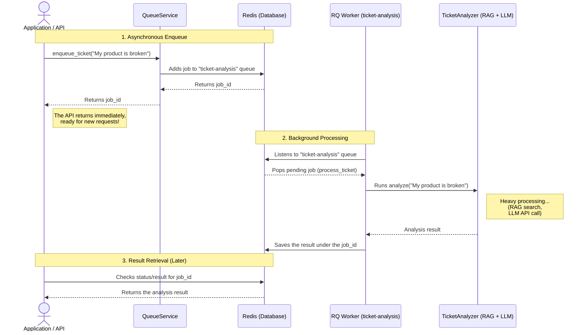
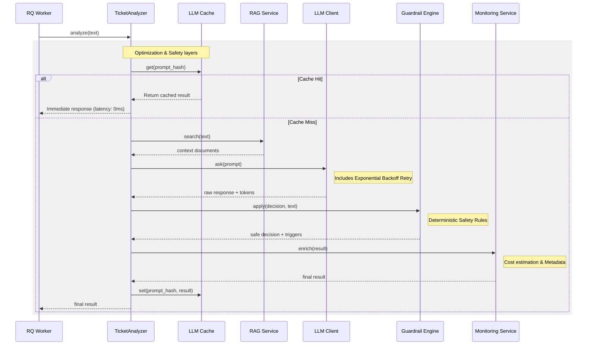

# ai-decision-engine

## Architecture 

This project uses an asynchronous queue system to handle long-running tasks, such as AI-driven ticket analysis, without blocking the main API.

### Queue & Worker System

The system is built on **Redis Queue (RQ)**:

1. **Redis Server**: Acts as the message broker (running on `localhost:6379`).
2. **Queue (`ticket-analysis`)**: The holding area for tasks waiting to be processed.
3. **QueueService**: Enqueues new tasks (e.g., when the API receives a new ticket) and returns a `job_id`.
4. **RQ Worker**: Runs in the background (via `rq worker ticket-analysis`), listens to the queue, and executes the heavy AI tasks (RAG + LLM analysis).

### Sequence Diagram

### 🧠 Internal AI Analysis Pipeline
When the worker executes the `TicketAnalyzer`, several layers are involved to ensure efficiency and safety:

### ✨ New AI Engine Features
- **LLM Caching**: SHA-256 based in-memory cache for prompt results.
- **Monitoring Service**: Token counting and estimated cost calculation.
- **Guardrail Engine**: Deterministic rules applied post-LLM (Urgency & Legal checks).
- **Retry Service**: Automatic retry with exponential backoff for API resilience.
